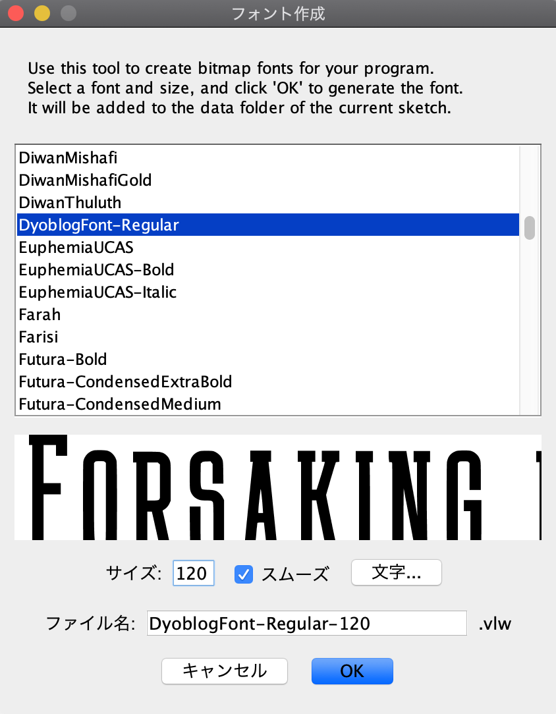
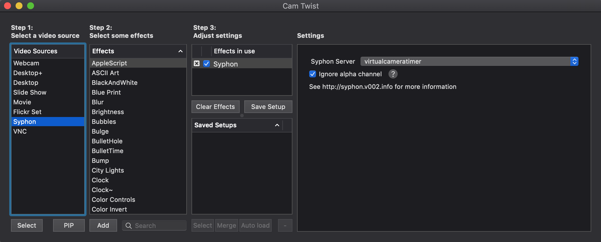
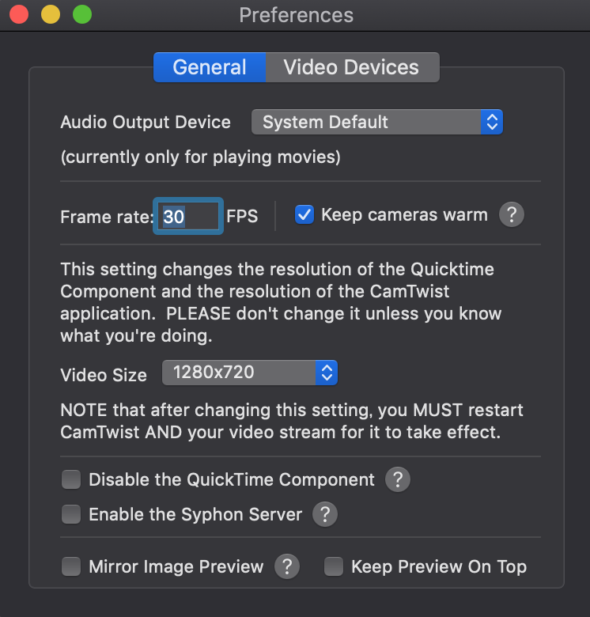
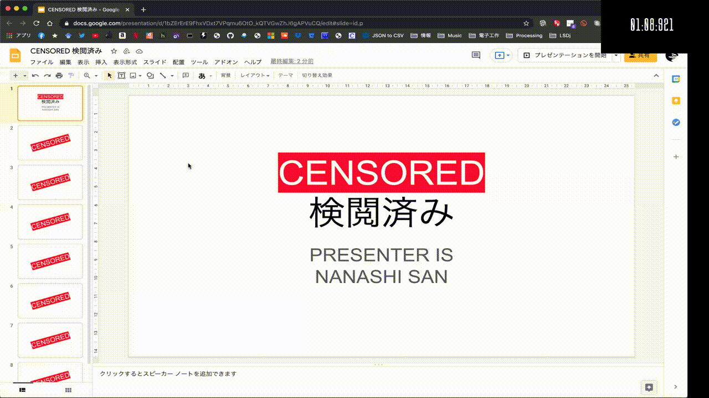

# Virtual Camera Timer

バーチャルカメラとして使えるタイマーです。  
  

## requires
Spout(as Processing Library)  
Syphon(as Processing Library)    
[DyoblogFont](https://www.dyoblog.com/entry/design/dyoblogfont)  

How to use(in English) is next to 利用方法(in Japanese)

# 利用方法
#### 1. 起動に必要なソフトウェアをインストールします。
[Processing](https://processing.org/)  

バーチャルカメラソフトウェア  
Mac: [CamTwist](http://camtwiststudio.com/)  
Win: [SpOut](https://spout.zeal.co/)  
など

リポジトリをクローンしてProcessingで起動します。

#### 2. vlwファイルを作ります  

メニューバー → ツール → フォント作成から   
"DyoblogFont-Regular"を選択、サイズを120にセットします。  

#### 3. Processingに必要なライブラリをインストールします。  

メニューバー → スケッチ → ライブラリをインポート → ライブラリを追加から  

"spout"と"syphon"を検索してインストール.  

#### 4. 実行
メニューバー → スケッチ → 実行  
"a"キーでタイマーを一時停止、再スタートできます。  
"q"キーでタイマーをリセットできます。  

#### 5. バーチャルカメラのセッティング(macOSの場合)
CamTwistを実行して設定します。  
あくまでこれは一例であり、設定は環境に依存します。  

Syphonをvideo sourceから選択しSyphon Serverの中から "virtualcameratimer"を選択します。  
一覧に現れない場合はProcessingが実行されていないか
なにかのエラーが起こっています。

#### 5. バーチャルカメラのセッティング(Windowsの場合)  
ここにウィンドウズでの使い方を書く

#### 6. 会議システムのビデオソースからバーチャルカメラを選択
カメラをオンにすると、タイマーが表示されます。

# How to use
#### 1. Install Requires Softwares.
Install  [Processing](https://processing.org/)  

Install Virtual Camera Software  
eg...  
Mac: [CamTwist](http://camtwiststudio.com/)  
Win: [SpOut](https://spout.zeal.co/)  

Clone this repository and open with Processing.  

#### 2. Create .vlw file.  

MenuBar → Tools → Create Font  
Select "DyoblogFont-Regular", Set Size 120  

#### 3. Install Additional Library.  

MenuBar → Sketch → Import Library → Add Library  

search and install "spout" and "syphon".  

#### 4. Run.
MenuBar → Sketch → Run  
Press "a" to timer stop and resume  
Press "q" to timer reset  

#### 5. Setting Virtual Camera(macOS)
Run CamTwist and Preference...  
It is just example!  

Select Syphon as video source and set Syphon Server as "virtualcameratimer".   

#### 5. Setting Virtual Camera(win)  
write here how to on windows.

#### 6. Select Virtual Camera as Video source on meeting tools.  
And video on to use.  

